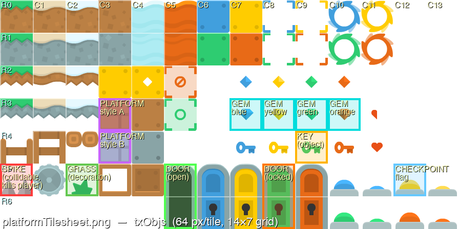
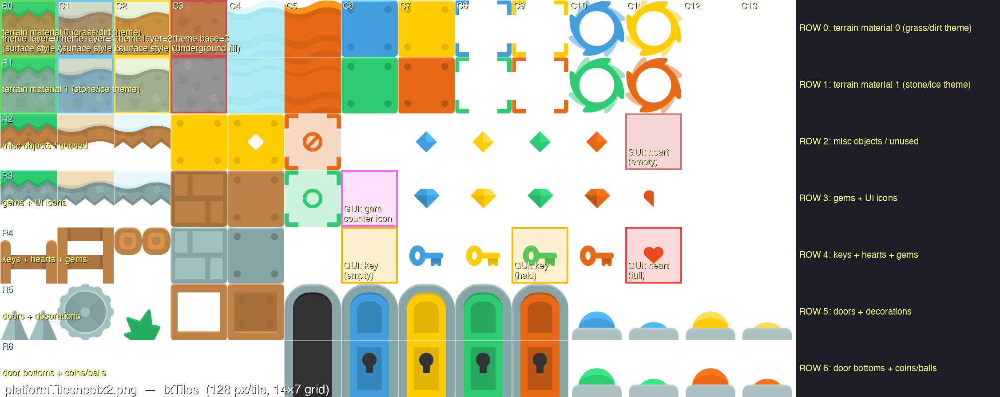
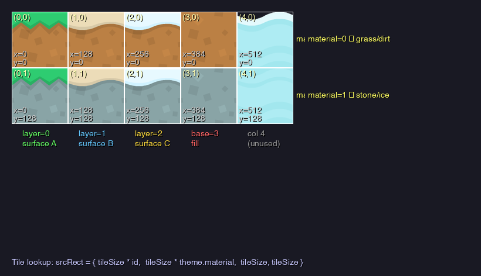
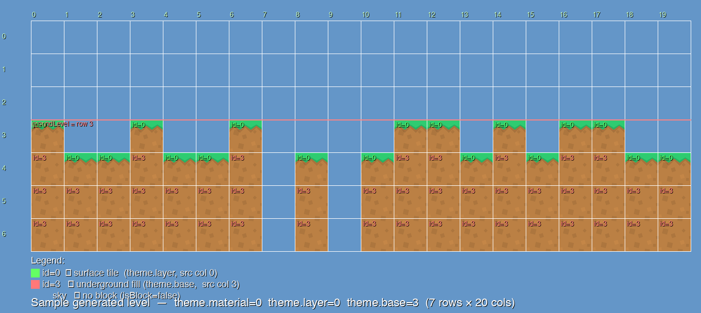

# Tilemap System — Two Approaches

A technical reference for tile-based rendering with raylib, covering **two distinct ways to
get a tile world on screen**:

1. **Editor-authored maps via Tiled JSON** — what the rayjs example at
   [`examples/tiled/tiled_map.js`](../examples/tiled/tiled_map.js) does, using the
   [`rayjs:ext:tiled`](ext_modules.md) module to load a `.tmj` file produced by the
   [Tiled](https://www.mapeditor.org/) editor.
2. **Procedural / hardcoded generation** — what the companion C++ `platformer-raylib` project
   does, generating the level in code from a random seed each session.

Both approaches sit on top of the same primitive (`DrawTextureRec` with a source rect into a
spritesheet); they differ only in *where the tile identifiers come from*.

> A styled, browsable HTML version with an interactive GID decoder is also available at
> [`tilemap_system.html`](tilemap_system.html).

---

## Table of Contents

- [1. Overview — The Spritesheet Technique](#1-overview--the-spritesheet-technique)
- [2. The Two Approaches at a Glance](#2-the-two-approaches-at-a-glance)
- [3. The Core Primitive — DrawTextureRec](#3-the-core-primitive--drawtexturerec)
- [4. The Spritesheets](#4-the-spritesheets)
- **Main: Tiled JSON approach**
  - [5. The .tmj File Format](#5-the-tmj-file-format)
  - [6. The rayjs:ext:tiled API](#6-the-rayjsexttiled-api)
  - [7. Walkthrough — examples/tiled/tiled_map.js](#7-walkthrough--examplestiledtiled_mapjs)
- [8. Object Sprite Reference](#8-object-sprite-reference)
- **Appendix: Procedural approach**
  - [A. The Theme System](#a-the-theme-system)
  - [B. Data Structures](#b-data-structures)
  - [C. Level Generation Pipeline](#c-level-generation-pipeline)
  - [D. Rendering the Procedural Map](#d-rendering-the-procedural-map)
  - [E. When to Choose Procedural vs Tiled](#e-when-to-choose-procedural-vs-tiled)
  - [F. Framework Equivalents for DrawTextureRec](#f-framework-equivalents-for-drawtexturerec)

---

## 1. Overview — The Spritesheet Technique

A **spritesheet** (also called a *texture atlas* or *tilesheet*) packs many individual sprites
into a single image arranged on a regular grid. Instead of loading hundreds of files, you load
one texture and use **source rectangles** to cut out exactly the portion you need when
drawing.

```
┌─────────────────────────────────────┐
│  spritesheet.png                    │
│  ┌──────┬──────┬──────┬──────┐      │
│  │ tile │ tile │ tile │ tile │  row0│
│  ├──────┼──────┼──────┼──────┤      │
│  │ tile │ tile │ tile │ tile │  row1│
│  └──────┴──────┴──────┴──────┘      │
│   col0   col1   col2   col3         │
└─────────────────────────────────────┘

To draw the tile at (col=2, row=1):
  srcRect.x = col * tileSize = 2 * 64 = 128
  srcRect.y = row * tileSize = 1 * 64 =  64
  srcRect.w = tileSize             = 64
  srcRect.h = tileSize             = 64
```

| Concern | Separate files | Spritesheet |
|---|---|---|
| GPU texture binds per frame | One per sprite drawn | One per sheet |
| Memory overhead | Many texture objects | Single texture |
| Load time | Many file I/O calls | One file I/O |
| Coordinate management | N/A | Arithmetic on (col, row) |

The whole game world is a 2D grid of integers. Each integer identifies a tile in the
spritesheet. The two approaches in this document differ in **where those integers come from**:
hand-authored in an editor, or generated in code.

---

## 2. The Two Approaches at a Glance

| Aspect | Tiled JSON (Main) | Procedural (Appendix) |
|---|---|---|
| Source of truth | `.tmj` file authored in [Tiled](https://www.mapeditor.org/) | Algorithm in code |
| Tile identifier | **GID** — flat integer in `layer.data[]` | `(theme.layer, theme.material)` per cell |
| Variation strategy | Multiple `.tmj` files / tilesets | Swap a few theme ints |
| Object placement | Drag-and-drop in editor → `objectgroup` | `placeObjects()` algorithm |
| Collision | `checkCollisionTiledLayer(map, "Ground", rect)` | `tileMap[row][col].isBlock` |
| Animated tiles | Built in via tileset `animation` | Roll your own |
| Tile flip & rotation | Top 3 bits of GID, handled by the lib | Roll your own |
| Best for | Hand-crafted platformers, puzzles | Roguelikes, infinite/random worlds |
| Example in this repo | [`examples/tiled/tiled_map.js`](../examples/tiled/tiled_map.js) | C++ `platformer-raylib` (sibling project) |

The two approaches are not exclusive — you can perfectly well author a base map in Tiled and
add a procedural layer for randomness on top (e.g. randomized decoration on top of an
editor-authored ground layer).

---

## 3. The Core Primitive — DrawTextureRec

Every tile in **both approaches** is ultimately drawn with the same raylib call:

```c
void DrawTextureRec(
    Texture2D texture,   // the loaded spritesheet
    Rectangle source,    // which region to cut from the sheet (in pixels)
    Vector2   position,  // where to draw it in world/screen space
    Color     tint       // colour multiplier — WHITE means no tint
);
```

In rayjs this is exposed verbatim:

```js
import { DrawTextureRec, Rectangle, Vector2, WHITE } from "rayjs:raylib"

DrawTextureRec(
  tileset.texture,
  new Rectangle(srcX, srcY, tileW, tileH),
  new Vector2(dstX, dstY),
  WHITE,
)
```

That single function backs the inner loop of `drawTiledMap` in
[`lib/tiled.js`](../lib/tiled.js) (Tiled approach) and the inner loop of `drawTileMap` in
the C++ `Platformer2D.cpp` (procedural approach). The difference is only in how `srcX`/`srcY`
get computed: from a GID lookup, or from `theme.layer * tileSize` arithmetic.

---

## 4. The Spritesheets

The rayjs example and the C++ project share artwork from the same two-file family:

| File | Tile size | Grid | Used by |
|---|---|---|---|
| `examples/platformTilesheet.png` | **64 × 64 px** | 14 cols × 7 rows | rayjs Tiled example (`txObjs` in C++) |
| `platformTilesheetx2.png` | **128 × 128 px** | 14 cols × 7 rows | C++ terrain (`txTiles`) |

The `x2` file is a 2× upscaled version of the same artwork — the C++ project runs at
`camera.zoom = 0.5` so the larger texels stay crisp at half scale. The rayjs example uses the
64 px sheet at native zoom.

### platformTilesheet.png — the sheet the Tiled example uses



This is the file referenced by `examples/tiled/resources/map.tmj` (via the path
`../../../examples/platformTilesheet.png`). Every tile in the Tiled map — ground, gems,
platforms, door, key — is a 64×64 cut from this sheet.

### platformTilesheetx2.png — the C++ terrain sheet



The C++ procedural renderer reads only a small region of this sheet (columns 0–3, rows 0–1)
for terrain, plus a scattering of cells in columns 6–13 for the GUI icons.

---

## 5. The .tmj File Format

A `.tmj` file is plain JSON exported by the [Tiled](https://www.mapeditor.org/) editor. It
fully describes a level: map dimensions, layers (tile and object), tilesets, and per-tile
metadata. The rayjs example loads one and renders it with `rayjs:ext:tiled`.

### 5.1 Anatomy of `examples/tiled/resources/map.tmj`

Here is the **entire** map file used by the rayjs example, annotated inline:

```jsonc
{
  // ── map header ────────────────────────────────────────────────────
  "width":  20,            // 20 tiles wide
  "height": 10,            // 10 tiles tall
  "tilewidth":  64,        // each tile is 64×64 px in this map's grid
  "tileheight": 64,
  "orientation": "orthogonal",
  "renderorder": "right-down",
  "infinite": false,
  "compressionlevel": -1,
  "version":      "1.10",
  "tiledversion": "1.10.2",
  "type": "map",
  "nextlayerid":  3,
  "nextobjectid": 3,

  // ── layers (drawn in array order) ─────────────────────────────────
  "layers": [
    {
      // Tile layer — a 20×10 flat array of GIDs
      "id":   1,
      "name": "Ground",
      "type": "tilelayer",
      "width":  20,
      "height": 10,
      "visible": true,
      "opacity": 1,
      "x": 0, "y": 0,
      "data": [
        // Row 0 — a few clouds and a small floating platform
        3, 12,  9, 10,  0,  0,  0,  0,  8,  8,  8,  0,  0,  0,  0,  0,  0,  0,  0,  0,
        // Rows 1–3 — empty sky
        0,  0,  0,  0,  0,  0,  0,  0,  0,  0,  0,  0,  0,  0,  0,  0,  0,  0,  0,  0,
        0,  0,  0,  0,  0,  0,  0,  0,  0,  0,  0,  0,  0,  0,  0,  0,  0,  0,  0,  0,
        0,  0,  0,  0,  0,  0,  0,  0,  0,  0,  0,  0,  0,  0,  0,  0,  0,  0,  0,  0,
        // Row 4 — a single floating ledge
        0,  0,  0,  0,  0,  2,  3,  4,  0,  0,  0,  0,  0,  0,  0,  0,  0,  0,  0,  0,
        // Row 5 — another floating ledge
        0,  0,  0,  0,  0,  0,  0,  0,  0,  0,  0,  2,  3,  4,  0,  0,  0,  0,  0,  0,
        // Row 6 — empty
        0,  0,  0,  0,  0,  0,  0,  0,  0,  0,  0,  0,  0,  0,  0,  0,  0,  0,  0,  0,
        // Row 7 — full ground (surface caps)
        1,  2,  3,  4,  5,  6,  7,  8,  9, 10, 11, 12,  1,  2,  3,  4,  5,  6,  7,  8,
        // Row 8 — underground fill row 1
       13, 14, 15, 16, 17, 18, 19, 20, 21, 22, 23, 24, 13, 14, 15, 16, 17, 18, 19, 20,
        // Row 9 — underground fill row 2 (bottom)
       25, 26, 27, 28, 29, 30, 31, 32, 33, 34, 35, 36, 25, 26, 27, 28, 29, 30, 31, 32
      ]
    },
    {
      // Object layer — annotations with positions & types
      "id":   2,
      "name": "Objects",
      "type": "objectgroup",
      "visible": true,
      "opacity": 1,
      "draworder": "topdown",
      "x": 0, "y": 0,
      "objects": [
        {
          "id": 1, "name": "Player", "type": "spawn",
          "x": 64, "y": 320,          // pixel position in world space
          "width":  64, "height": 64,
          "rotation": 0, "visible": true
        },
        {
          "id": 2, "name": "Coin", "type": "pickup",
          "x": 320, "y": 192,
          "width":  64, "height": 64,
          "rotation": 0, "visible": true
        }
      ]
    }
  ],

  // ── tilesets used by the map ──────────────────────────────────────
  "tilesets": [
    {
      "firstgid":   1,        // GIDs in data[] are offset by this value
      "name":       "platformTilesheet",
      "image":      "../../../examples/platformTilesheet.png",
      "imagewidth": 896,
      "imageheight": 448,
      "tilewidth":  64,       // size of one tile in the source image
      "tileheight": 64,
      "columns":    12,       // tiles per row to use from the image
      "tilecount":  60,       // 12 cols × 5 rows = 60 tiles indexed
      "margin":     0,
      "spacing":    0
    }
  ]
}
```

A few things worth noticing:

- **`data[]` is row-major.** The cell at `(col, row)` lives at `data[row * width + col]`.
- **`0` means empty.** Any other value is a GID (see §5.2).
- **Image dimensions can exceed the tileset's indexable region.** The image is 896×448 px
  (14 × 7 tiles) but the tileset is configured with `columns: 12` and `tilecount: 60`, so it
  exposes only the first 12 columns × 5 rows. The last 2 columns and last 2 rows of the
  image are not addressable through this tileset (a common artist/editor choice).
- **Object positions are in pixels**, not tile units. `x: 64, y: 320` means the Player spawn
  is one tile from the left and five tiles down.

### 5.2 GIDs — How an Integer Encodes (Tileset, Col, Row, Flip)

Each entry in `data[]` is a **GID** (global tile ID) — a 32-bit integer that packs four
pieces of information:

```
 31 30 29 28          0
┌──┬──┬──┬──────────────┐
│ H│ V│ D│  tile gid    │
└──┴──┴──┴──────────────┘
  └──┬──┘   └──────┬────┘
  flip bits        29-bit tile identifier
```

The top 3 bits are **flip flags** (set when you flip/rotate a tile in Tiled):

| Bit | Mask | Meaning |
|---|---|---|
| 31 | `0x80000000` | `FLIP_H` — horizontal flip |
| 30 | `0x40000000` | `FLIP_V` — vertical flip |
| 29 | `0x20000000` | `FLIP_D` — diagonal flip (combined with H/V, encodes 90° rotations) |

The lower 29 bits are the actual GID. Strip the flip bits with `rawGid & 0x1FFFFFFF`.

#### Resolving a GID to a source rectangle

```
gid     = rawGid & 0x1FFFFFFF            // strip flip bits
ts      = tileset whose firstgid is the highest value ≤ gid
localId = gid - ts.firstgid              // 0-based index within that tileset
col     = localId %   ts.columns
row     = localId \   ts.columns         // integer division
srcX    = ts.margin + col * (ts.tilewidth  + ts.spacing)
srcY    = ts.margin + row * (ts.tileheight + ts.spacing)
```

This is exactly what `_drawTileLayer` does in [`lib/tiled.js:290-294`](../lib/tiled.js).

#### Worked examples (using the map's tileset)

For the example's tileset (`firstgid=1, columns=12, margin=0, spacing=0`):

| Raw GID | Strip flip | localId | col | row | srcX | srcY |
|---|---|---|---|---|---|---|
| 1   | 1   | 0  | 0  | 0 | 0   | 0   |
| 12  | 12  | 11 | 11 | 0 | 704 | 0   |
| 13  | 13  | 12 | 0  | 1 | 0   | 64  |
| 36  | 36  | 35 | 11 | 2 | 704 | 128 |
| `0xA0000001` (H+D flipped GID 1) | 1 | 0 | 0 | 0 | 0 | 0 + flip flags applied at draw |

The HTML version of this document includes an **interactive GID decoder** in §5.2 — type a
number and see the (col, row) and source rect computed live.

#### Note: `columns` controls the wrap, not the image width

`columns` is the number of tiles in a row of the tileset, which the lookup math divides by.
It is **not** necessarily `imagewidth / tilewidth`. In the example, `columns=12` but the image
is 14 tiles wide; only the first 12 are addressable. If you ever see "the wrong tile is being
drawn at the edges," check that `columns` matches what you think.

### 5.3 Layer Types

The Tiled JSON format defines four layer types. The rayjs lib handles them as follows:

| `type` | What it is | rayjs:ext:tiled behaviour |
|---|---|---|
| `tilelayer` | 2D array of GIDs | Drawn by `drawTiledMap`; collidable via `checkCollisionTiledLayer` |
| `objectgroup` | List of named objects with positions, types, custom properties | **Not auto-drawn**; access via `getTiledObjects(map, "LayerName")` |
| `group` | Nested layers with shared offset/opacity | Recursively walked by `drawTiledMap` |
| `imagelayer` | A single image at an offset | **Not auto-drawn**; you can read it from `map.layers` and draw it yourself |

Object groups are how the rayjs example knows where to spawn the player and where to place
the coin — see §7.

---

## 6. The rayjs:ext:tiled API

The full TypeScript surface is in [`lib/tiled.d.ts`](../lib/tiled.d.ts). The implementation is
[`lib/tiled.js`](../lib/tiled.js), embedded into the `rayjs` binary as `rayjs:ext:tiled` via
the [ext-modules system](ext_modules.md).

### 6.1 Lifecycle — `loadTiledMap` / `unloadTiledMap`

```js
import { loadTiledMap, unloadTiledMap } from "rayjs:ext:tiled"

const map = loadTiledMap("resources/map.tmj")
// ... use the map ...
unloadTiledMap(map)
```

`loadTiledMap` reads the `.tmj`, resolves external tilesets (`.tsj`) relative to the map
file, and **uploads each tileset image to GPU memory** via `LoadTexture`. Pair it with
`unloadTiledMap` before you close the window.

> ⚠️  Base64 and compressed tile data are **not supported**. In Tiled's *File → Save As → Map
> Properties* set Tile Layer Format to **CSV** or **plain array**.

The returned `TiledMap` object exposes `width`, `height`, `tilewidth`, `tileheight`,
`backgroundcolor`, `layers[]`, `tilesets[]`. Layers are the raw parsed JSON — tilesets are
processed: each one carries a `texture` (`Texture2D` handle) ready for rendering.

### 6.2 `drawTiledMap` — What It Does

```js
import { drawTiledMap } from "rayjs:ext:tiled"
drawTiledMap(map, 0, 0, WHITE)
```

Internally it walks visible `tilelayer` and `group` layers and, for each non-empty cell,
runs the GID-to-source-rect math from §5.2 then calls `DrawTextureRec` (or `DrawTexturePro`
when flip bits require it). This is the **exact same primitive as the procedural approach in
Appendix D** — only the lookup differs.

A tightened excerpt of the inner loop, from [`lib/tiled.js:272-302`](../lib/tiled.js):

```js
for (let row = 0; row < lh; row++) {
  for (let col = 0; col < lw; col++) {
    const rawGid = data[row * lw + col]
    if (!rawGid) continue                   // 0 = empty

    const gid = rawGid & GID_MASK
    const ts  = _tilesetForGid(map.tilesets, gid)
    let localId = gid - ts.firstgid

    // Animated tiles substitute their current frame's local id.
    const anim = map._animState[gid]
    if (anim) {
      const frames = ts.animations[localId]
      if (frames) localId = frames[anim.frameIndex].tileid
    }

    const srcCol = localId % ts.columns
    const srcRow = Math.floor(localId / ts.columns)
    const srcX   = ts.margin + srcCol * (ts.tilewidth  + ts.spacing)
    const srcY   = ts.margin + srcRow * (ts.tileheight + ts.spacing)

    _drawTile(ts, srcX, srcY,
              map.tilewidth, map.tileheight,
              posX + col * map.tilewidth,
              posY + row * map.tileheight,
              rawGid, tint)              // rawGid passed so flip bits apply
  }
}
```

Object groups and image layers are intentionally not drawn — you decide how to render
those (typically: not at all for spawn markers; manually with your own sprite for pickups
that are part of gameplay).

### 6.3 `updateTiledMap` — Animated Tiles

If any tile in any tileset has an `animation` array (set in Tiled's *Tile Animation Editor*),
the loader builds an animation timer for it. Call once per frame **before** `drawTiledMap`:

```js
updateTiledMap(map, GetFrameTime())   // dt in seconds
```

`drawTiledMap` then substitutes the current frame's local tile id when it encounters an
animated GID — see the `anim` block in the snippet above.

### 6.4 `getTiledObjects` — Spawn Points and Pickups

```js
const objs = getTiledObjects(map, "Objects")
const spawn = objs.find(o => o.type === "spawn")
const coins = objs.filter(o => o.type === "pickup")
```

`getTiledObjects` returns the raw `TiledObject[]` from a named `objectgroup`. Each carries
`name`, `type` (the custom type string set in Tiled), `x`, `y`, `width`, `height`,
`rotation`, `visible`, optionally `gid` (for tile objects), `point`, `ellipse`, `polygon`,
`polyline`, and `properties`. This is your bridge from level design to gameplay code.

### 6.5 `checkCollisionTiledLayer` — AABB Resolution

```js
const hit = checkCollisionTiledLayer(map, "Ground", playerRect)
if (hit.hit) {
  // hit.tileX, hit.tileY  — grid coordinates of the colliding tile
  // hit.tileRect          — world-space Rectangle of that tile
}
```

Returns `{ hit: false }` if the rect overlaps nothing, otherwise the **first colliding tile in
top-left raster order** with its world-space `tileRect`. The example uses this with a swept
approach (move on one axis, resolve, move on the other axis, resolve) — see §7.

Two related helpers exist for object layers:

- `checkCollisionTiledObjects(map, "Objects", rect)` — returns the first colliding
  `TiledObject` (supports rectangle, ellipse-as-AABB, and polygon).
- `getTiledCollisionRects(map, "Objects")` — returns all rectangle objects as `Rectangle[]`,
  useful for pre-computing a static collision list once at load time.

---

## 7. Walkthrough — `examples/tiled/tiled_map.js`

The full example is ~130 lines. Here's what each phase does, with file:line references.

### 7.1 Setup and load

[`tiled_map.js:1-32`](../examples/tiled/tiled_map.js)

```js
import { loadTiledMap, updateTiledMap, drawTiledMap, unloadTiledMap,
         getTiledObjects, checkCollisionTiledLayer } from "rayjs:ext:tiled"

InitWindow(SCREEN_W, SCREEN_H, "rayjs - Tiled map")
SetTargetFPS(60)

const map  = loadTiledMap("resources/map.tmj")
const mapW = map.width  * map.tilewidth     // 20 * 64 = 1280 px
const mapH = map.height * map.tileheight    // 10 * 64 =  640 px
```

The map dimensions in pixels (`mapW`, `mapH`) are derived from the JSON header; they're used
later to clamp the player inside the world.

### 7.2 Find the spawn point

[`tiled_map.js:36-38`](../examples/tiled/tiled_map.js)

```js
const spawn = getTiledObjects(map, "Objects").find(o => o.type === "spawn")
let playerX  = spawn ? spawn.x : 64
let playerY  = spawn ? spawn.y : mapH - map.tileheight * 3 - PH
```

`getTiledObjects` returns the `Objects` layer's array. The `.find(o => o.type === "spawn")`
locates the Player marker from the editor (the one with `"type": "spawn"` in §5.1). This is
the pattern for "wire editor metadata into gameplay" — set a custom `Type` string in Tiled,
query it by string in code.

### 7.3 Player sprite from the tileset

[`tiled_map.js:23-27`](../examples/tiled/tiled_map.js)

```js
const PLAYER_SRC = new Rectangle(448, 320, 64, 128)   // col 7, row 5, 64×128 region
```

The player itself isn't a tile in the map — it's a sprite drawn directly from the tileset
texture (`map.tilesets[0].texture`) with a custom source rect. This is one nice side-effect
of the lib exposing tilesets: you can re-use the same texture for non-tilemap sprites without
loading a second image.

### 7.4 Per-frame loop — input

[`tiled_map.js:50-74`](../examples/tiled/tiled_map.js)

```js
const dt = GetFrameTime()

let moveX = 0
if (IsKeyDown(KEY_LEFT))  moveX = -PLAYER_SPEED
if (IsKeyDown(KEY_RIGHT)) moveX =  PLAYER_SPEED

const jumpHeld      = IsKeyDown(KEY_UP) || IsKeyDown(KEY_SPACE)
const jumpTriggered = jumpHeld && !jumpKeyDown
jumpKeyDown = jumpHeld
jumpBuffer  = Math.max(0, jumpBuffer - dt)
if (jumpTriggered) jumpBuffer = 0.12        // 120 ms "coyote-time-like" buffer
```

The 120 ms jump buffer makes the controls feel responsive: if you press jump just before
landing, the jump fires on landing instead of being dropped.

### 7.5 Per-frame loop — swept collision

[`tiled_map.js:61-101`](../examples/tiled/tiled_map.js)

```js
// X axis first, then Y. Each axis uses an inset rect to avoid corner-sticking.
playerX += moveX * dt
const rxRect = new Rectangle(playerX, playerY + 2, PW, PH - 4)
const hx = checkCollisionTiledLayer(map, "Ground", rxRect)
if (hx.hit) {
  if (moveX > 0) playerX = hx.tileRect.x - PW
  else           playerX = hx.tileRect.x + hx.tileRect.width
}

velY    += GRAVITY * dt
playerY += velY * dt
const ryRect = new Rectangle(playerX + 2, playerY, PW - 4, PH)
const hy = checkCollisionTiledLayer(map, "Ground", ryRect)
if (hy.hit) {
  if (velY >= 0) {
    playerY  = hy.tileRect.y - PH      // landing
    velY     = 0
    onGround = true
  } else {
    playerY = hy.tileRect.y + hy.tileRect.height   // ceiling
    velY    = 0
  }
}
```

Two important details:

- **Swept (separate axis) resolution.** Move on one axis, check, snap. Then move on the other.
  Resolving X and Y together causes well-known "stuck in a corner" bugs.
- **Inset rects.** The X check uses `(playerY + 2, height - 4)`; the Y check uses
  `(playerX + 2, width - 4)`. The 2 px inset on each side prevents the rect's corner from
  catching on the edge of a tile when the player is exactly flush with a surface.

`hit.tileRect` is what makes snapping simple: it's the world-space rectangle of the tile
that was hit, so `tileRect.x - PW` is exactly where the player's left edge has to land to be
flush with the wall.

### 7.6 Per-frame loop — draw

[`tiled_map.js:106-127`](../examples/tiled/tiled_map.js)

```js
updateTiledMap(map, dt)                         // advance animated tiles

BeginDrawing()
  ClearBackground(/* map.backgroundcolor → Color */)

  BeginMode2D(camera)
    drawTiledMap(map, 0, 0, WHITE)
    DrawTextureRec(map.tilesets[0].texture, PLAYER_SRC,
                   new Vector2(playerX, playerY), WHITE)
  EndMode2D()

  DrawFPS(8, 8)
  DrawText(...)
EndDrawing()
```

`updateTiledMap` ticks animated-tile timers (no-op in this map since no tile has an
animation). `drawTiledMap` walks the visible tile layers (just `Ground` here). Then the
player is drawn with `DrawTextureRec` directly — same primitive, called by your code instead
of the lib.

### 7.7 Cleanup

[`tiled_map.js:130-131`](../examples/tiled/tiled_map.js)

```js
unloadTiledMap(map)
CloseWindow()
```

`unloadTiledMap` calls `UnloadTexture` on every tileset's GPU texture. Forgetting this leaks
GPU memory until the process exits.

---

## 8. Object Sprite Reference

Coordinates are `(col, row)` on the 64 px grid of `platformTilesheet.png`. The Tiled map and
the C++ project share these positions (the C++ project's `txObjs` is the same image).

| Sprite | Col | Row | Size | Notes |
|---|---|---|---|---|
| Spike | 0 | 5 | 64×64 | Damages player |
| Grass decoration | 2 | 5 | 64×64 | Cosmetic |
| Gem (blue) | 7 | 3 | 64×64 | Collectable |
| Gem (yellow) | 8 | 3 | 64×64 | Collectable |
| Gem (green) | 9 | 3 | 64×64 | Collectable |
| Gem (orange) | 10 | 3 | 64×64 | Collectable |
| Platform style A | 3 | 3 | 64×64 | Floating platform |
| Platform style B | 3 | 4 | 64×64 | Floating platform |
| Key (world) | 9 | 4 | 64×64 | Pick-up |
| Door (locked) | 8 | 5 | 64×128 | Spans rows 5–6 |
| Door (open) | 5 | 5 | 64×128 | Spans rows 5–6 |
| Checkpoint flag | 12 | 5 | 64×64 | Respawn marker |
| Player (tall) | 7 | 5 | 64×128 | Used by the rayjs example as `PLAYER_SRC` |

For the rayjs map, the GIDs that show up in `Ground.data[]` correspond to the surface caps
and underground fill from rows 0–2 of the tileset (GIDs 1–36 cover columns 0–11 of those rows).

---

# Appendix — The Procedural Approach

This appendix documents the **alternative** technique used by the companion C++
`platformer-raylib` project: instead of loading a `.tmj`, the level is generated in code from
a random seed at the start of each session. It's preserved here as a comparison and as a
reference for anyone wanting to add procedural levels to a rayjs project.

The procedural approach uses **two integers per cell** (`material`, `layer`/`base`) instead
of a single GID. Otherwise it shares everything from §3 (the `DrawTextureRec` primitive) and
§4 (the spritesheets, on the `x2` variant).

## A. The Theme System

`setNewTheme()` randomizes three integers per level:

```cpp
void Game::setNewTheme(void) {
    theme.material = GetRandomValue(0, 1);  // row 0=grass/dirt, 1=stone/ice
    theme.layer    = GetRandomValue(0, 2);  // col 0/1/2 = surface variant
    theme.base     = 3;                     // col 3 = underground fill (fixed)
}
```

The whole terrain visual style is derived from those three ints:

```
srcRect.x = tileSize * tile.id        ← column: theme.layer (0/1/2) or theme.base (3)
srcRect.y = tileSize * theme.material ← row:    0 (grass) or 1 (stone)
srcRect.w = tileSize                  ← always 128
srcRect.h = tileSize                  ← always 128
```



Compare this with the Tiled approach in §5.2: same shape (column × tileSize, row × tileSize),
but the inputs come from theme variables rather than a GID lookup.

## B. Data Structures

```cpp
// game/src/Platformer2D.h

typedef struct Tile {
    int   id;       // which column to draw (set at render time, not stored)
    bool  isBlock;  // solid or empty (air)
    float x, y;     // world-space pixel position
} Tile;

typedef struct Sprite {
    Rectangle frame;       // source rect in txObjs
    bool      checkPoint;
    bool      collidable;
    bool      collectable;
    bool      visible;
    float     width, height;
    float     x, y;
} Sprite;

typedef struct Theme {
    int material;  // row    (0 or 1)
    int layer;     // surface col (0, 1, or 2)
    int base;      // underground col (always 3)
} Theme;

const float tileSize = 128.0f;
const float objSize  = 64.0f;
const int   totalRow    = 7;
const int   totalColumn = 20;
const int   totalObjects   = 50;
const int   totalPlatforms = 30;

Tile   tileMap[totalRow][totalColumn];
Sprite objects[totalObjects];
Sprite platforms[totalPlatforms];
```

**Object pools.** `objects[]` and `platforms[]` are fixed-size arrays allocated once. Each
new level resets `visible` and reassigns `x`, `y`, `frame` — no heap allocation during play.

## C. Level Generation Pipeline

`makeLevel()` calls five functions in order:

```
makeLevel()
  ├── generateTileMap()    fills tileMap[][] with isBlock booleans
  ├── generateObjects()    assigns frame rects to object pool (no positions yet)
  ├── generatePlatforms()  assigns frame rects to platform pool (no positions yet)
  ├── placeObjects()       walks tileMap, assigns world positions to objects
  └── placePlatforms()     walks tileMap, assigns world positions to platforms
```

### C.1 `generateTileMap` — the logical grid

```cpp
int groundLevel = 3;  // rows 0-2 are always open sky

for (int x = 0; x < totalColumn; x++) {
    pGround = (x > 3 && x != totalColumn - 1) ? GetRandomValue(0, 3) : 1;
    pHill   = GetRandomValue(0, 2);

    for (int y = 0; y < totalRow; y++) {
        if ((y < groundLevel) || (pGround == 0 && tileMap[y][x-1].isBlock))
            tileMap[y][x].isBlock = false;   // sky or gap after solid
        else if ((y == groundLevel) && (pHill == 0))
            tileMap[y][x].isBlock = false;   // hill notch
        else {
            tileMap[y][x].isBlock = true;
            pGround = 1;                     // fill all rows below
        }
    }
}
```

Rules:
- Rows 0–2 are always air.
- `pGround == 0` → entire column is a gap (only if the previous column was solid).
- `pHill == 0` → only the top surface tile is removed.
- Once any block is set in a column, all rows below it are also set.
- First 4 and last column are always solid.



### C.2 `generateObjects` — object template pool

```
probability 1/11  → SPIKE     col 0, row 5
probability 2/11  → GRASS     col 2, row 5
probability 8/11  → GEM       col (7-10), row 3
```

### C.3 `generatePlatforms` — platform template pool

```cpp
frame = { objSize * 3,  objSize * (3 + rand(0,1)), objSize, objSize };
// col 3, row 3 OR row 4 — random visual style
```

### C.4 `placeObjects` — spatial placement

A tile qualifies for an object if it's a block, the tile above it is air, and it's not in
row 0. The object is placed `objSize` above the tile, on a random half (left/right).

Special objects are injected by `x` threshold:
- `x >= totalColumn/3` → checkpoint (once)
- `x >= totalColumn/2` → key (once, after checkpoint)
- `x == totalColumn-1` → door (and return)

### C.5 `placePlatforms` — spatial placement

A tile qualifies for a floating platform if it's a block with air above, not near edges,
neither diagonal-above neighbour is a block, and a 50% coin flip succeeds.

## D. Rendering the Procedural Map

### D.1 `drawTileMap`

```cpp
void Game::drawTileMap(void) {
    Rectangle srcRect = { 0, theme.material * tileSize, tileSize, tileSize };

    for (int y = 0; y < totalRow; y++) {
        for (int x = 0; x < totalColumn; x++) {
            if (!tileMap[y][x].isBlock) continue;

            tileMap[y][x].id = (y > 0 && tileMap[y-1][x].isBlock)
                                 ? theme.base     // block above → underground
                                 : theme.layer;   // no block above → surface
            srcRect.x = tileSize * tileMap[y][x].id;

            DrawTextureRec(txTiles, srcRect,
                           Vector2{ tileMap[y][x].x, tileMap[y][x].y }, WHITE);
        }
    }
}
```

The `tile.id` is **computed fresh each frame**, not stored. Flip `theme.layer` and the next
frame draws a different visual style for free — no regeneration needed.

### D.2 `drawObjects` and `drawPlatforms`

```cpp
DrawTextureRec(txObjs, objects[i].frame,
               Vector2{ objects[i].x, objects[i].y }, WHITE);

// Door swaps column based on level completion
door.frame.x = complete ? objSize * 5 : objSize * 8;
DrawTextureRec(txObjs, door.frame, Vector2{ door.x, door.y }, WHITE);
```

### D.3 `drawGUI`

The HUD draws from `txTiles` (128 px sheet) **after** `EndMode2D()`, so it's in screen space.

### D.4 Camera2D

```cpp
camera.target = player.pos;
camera.offset = { width/2, height/2 };
camera.zoom   = 0.5f;   // 128 px tile renders as 64 screen px
```

Smooth follow: only moves the camera when the player is more than 20 px from the target;
acceleration is proportional to distance, with a minimum speed.

## E. When to Choose Procedural vs Tiled

| Use procedural when… | Use Tiled when… |
|---|---|
| Levels are random per run (roguelikes) | Levels are hand-crafted, named, finite |
| You need infinite-scrolling worlds | Each level fits in a single map |
| The variation rules are simple and code-friendly | The variation is artistic, not mechanical |
| You have no designer / non-engineer collaborators | You have designers who want to author levels |
| The visual style is uniform across the world | You need rich per-tile metadata (properties, animations) |

You can also combine them: editor-authored ground layer + procedurally-spawned decoration on
top, or a fixed Tiled tileset paired with code-generated `data[]`.

## F. Framework Equivalents for `DrawTextureRec`

| Framework / Language | Equivalent call |
|---|---|
| **SDL2 (C/C++)** | `SDL_RenderCopy(renderer, texture, &srcRect, &dstRect)` |
| **SFML (C++)** | `sprite.setTextureRect(sf::IntRect{x,y,w,h}); window.draw(sprite)` |
| **Pygame (Python)** | `screen.blit(sheet, (dst_x, dst_y), (src_x, src_y, w, h))` |
| **Love2D (Lua)** | `love.graphics.draw(sheet, love.graphics.newQuad(...))` |
| **Godot (GDScript)** | `draw_texture_rect_region(tex, dst_rect, src_rect)` |
| **Unity (C#)** | `Graphics.DrawTexture(dst_rect, tex, src_rect, ...)` |
| **HTML5 Canvas (JS)** | `ctx.drawImage(sheet, sx, sy, sw, sh, dx, dy, dw, dh)` |
| **MonoGame / XNA (C#)** | `spriteBatch.Draw(tex, dstPos, srcRect, Color.White)` |
| **Raylib (any lang)** | `DrawTextureRec(texture, srcRect, position, WHITE)` |
| **rayjs (this project)** | `DrawTextureRec(texture, srcRect, position, WHITE)` |

The portability of this technique is the whole point — once you have these two capabilities
(load a texture, blit a sub-rect), every approach in this document is the same code with
different inputs.
